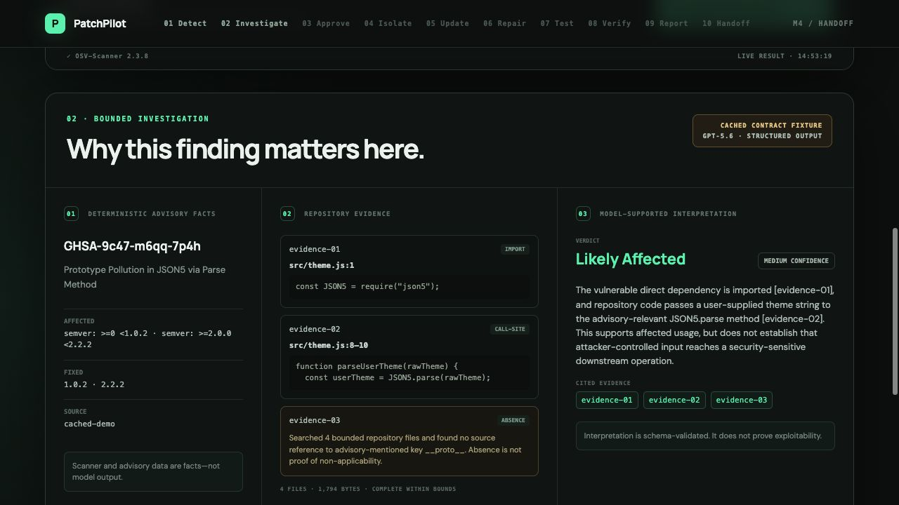
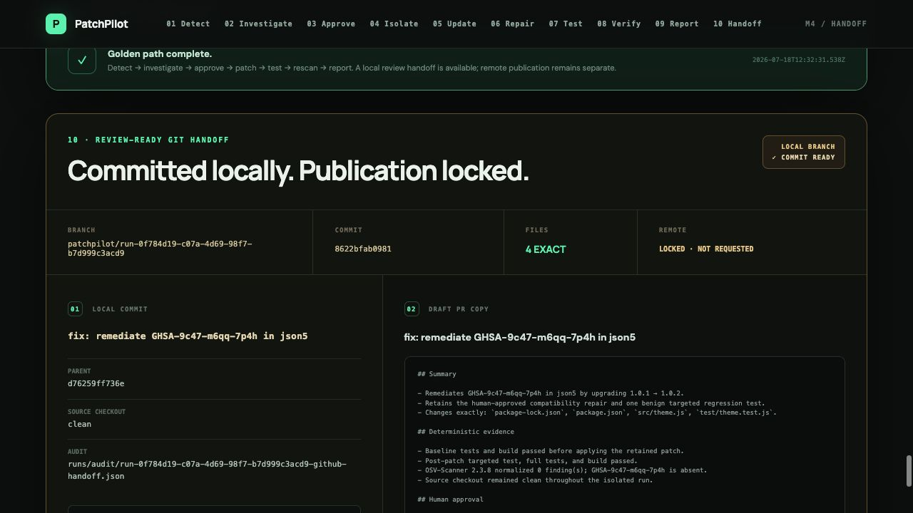
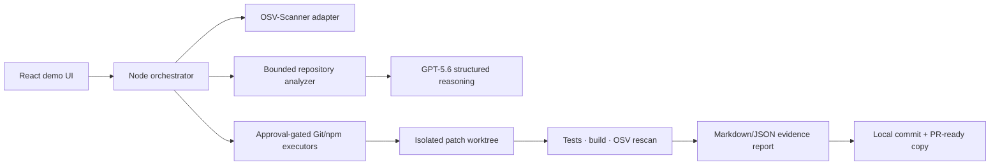

# PatchPilot

PatchPilot investigates one known npm dependency vulnerability against the actual repository, creates the smallest human-approved patch, and proves the result with tests and a rescan.

[](https://github.com/DmytroHuzz/patchpilot/actions/workflows/ci.yml)
[](https://github.com/DmytroHuzz/patchpilot/actions/workflows/demo-smoke.yml)
[](LICENSE)

> OpenAI Build Week 2026 · Developer Tools · narrow golden-path demo, not a production security platform

## The problem

Dependency scanners answer “is a vulnerable package installed?” A maintainer still has to determine whether the repository uses the affected API, choose a compatible fix, constrain the change, write a meaningful regression test, run the right commands, rescan, and explain what remains uncertain.

PatchPilot connects those steps without replacing deterministic tools or the human decision. OSV-Scanner owns vulnerability facts, repository and command output supply evidence, GPT‑5.6 supplies bounded interpretation and proposals, and a person approves the exact plan before any patch write.

## Demo screenshots

| Repository-specific investigation | Verified local handoff |
| --- | --- |
|  |  |

The screenshots are from the bundled golden repository using the checked-in, visibly labeled `cached-demo` GPT‑5.6 fixtures. The scanner, Git, npm, test, build, and rescan results are real local command facts.

## Golden workflow

```text
Detect → investigate → approve → patch → test → rescan → report → local handoff
```

1. Detect `GHSA-9c47-m6qq-7p4h` in direct dependency `json5@1.0.1`.
2. Cite the import and `JSON5.parse` call in `src/theme.js`.
3. Label GPT‑5.6’s affectedness conclusion as interpretation and retain unknowns.
4. Show the exact four-file plan and require explicit approval.
5. Create an isolated `patchpilot/run-*` worktree and update `json5` to `1.0.2`.
6. Apply one bounded compatibility repair and add one benign regression test.
7. Compare baseline and post-patch tests/build, then rescan the patched lockfile.
8. Generate Markdown/JSON evidence and a review-ready local commit plus draft-PR copy.

## Architecture



The orchestrator keeps deterministic facts, model interpretation, human decisions, and unresolved uncertainty in separate validated contracts. See [Architecture](docs/architecture.md) for the component diagram, workflow state machine, trust boundaries, and stage-by-stage design.

## How OSV-Scanner is reused

PatchPilot downloads the official OSV-Scanner `2.3.8` release for the current macOS/Linux architecture and verifies it against the upstream SHA-256 manifest. It invokes the binary directly—never through a shell—and normalizes only the JSON fields used by PatchPilot.

The initial scan runs against the bundled repository. The final scan uses the approved patched `package-lock.json` because OSV-Scanner’s directory discovery ignores Git worktree roots. Exit code `1` is accepted only when valid finding JSON is present; malformed output and scanner failures remain errors. Vulnerability identity, versions, ranges, and rescan state are deterministic scanner facts, never model knowledge.

## What PatchPilot adds

- Bounded import, call-site, configuration, and absence evidence with exact file/line references.
- Schema-validated GPT‑5.6 affectedness interpretation with confidence, citations, unknowns, limitations, and next checks.
- A minimal remediation plan whose versions, files, commands, and tests are validated before display.
- A digest-bound human approval gate before repository writes.
- Canonically contained Git worktree isolation and exact changed-file checkpoints.
- At most two bounded source-repair attempts and exactly one safe targeted test proposal.
- Baseline/post-patch command evidence and an honest selected-advisory rescan.
- Reviewable Markdown/JSON reports and an approval-locked local Git handoff.

PatchPilot is therefore an evidence and remediation layer around the scanner—not another vulnerability database or blind version-bump bot.

## Golden-path verification metrics

These are verification results for one bundled demo run, not general benchmarks.

| Metric | Golden result |
| --- | --- |
| Finding detected | Yes — `GHSA-9c47-m6qq-7p4h` in `json5@1.0.1` |
| Relevant code location identified | Yes — `src/theme.js:1` and `src/theme.js:8–10` |
| Evidence references valid | 3/3 (100%) at report generation |
| Selected finding removed | Yes — zero normalized selected-advisory findings after patch |
| Existing tests passing after patch | 2/2 (100%); targeted test adds a third passing test |
| Targeted regression test added | Yes — one benign unsupported-field test |
| Unrelated files changed | 0; four approved files changed |
| Manual decisions required | One explicit write approval; 11 narrated UI button actions total |
| Observed approval-to-handoff duration | About 76 seconds on the recorded local acceptance machine; environment-dependent |
| Compatibility repair iterations | 1/2 |

## Supported environment

- Node.js 20 or newer and npm workspaces.
- Git with worktree support.
- macOS (`arm64` or `x86_64`) or Linux (`arm64`/`aarch64` or `x86_64`).
- Network access for the first OSV-Scanner download, npm install, and live OSV database queries.
- A modern browser for the local React UI at `127.0.0.1`.
- Optional OpenAI API access for live GPT‑5.6 calls; the deterministic demo does not require it.

Windows and non-npm package ecosystems are not supported by this hackathon build.

## Installation

From a fresh clone:

```bash
git clone https://github.com/DmytroHuzz/patchpilot.git
cd patchpilot
npm ci
./scripts/setup-osv-scanner.sh
npm run check
./scripts/verify-demo.sh
```

`setup-osv-scanner.sh` selects the platform asset, verifies the official checksum, and installs the binary only under ignored `tools/bin/`. `verify-demo.sh` safely resets the bundled nested Git fixture, installs its dependencies without lifecycle scripts, runs its baseline tests/build, performs the live scan, and requires the expected finding.

For a dependency-and-build-only bootstrap, run `./scripts/bootstrap.sh`; scanner setup and the live demo verification remain separate commands.

## Environment variables

PatchPilot reads variables from the launching shell; it does not automatically load `.env` files.

| Variable | Required | Behavior |
| --- | --- | --- |
| `OPENAI_API_KEY` | No | Enables live `gpt-5.6` Responses API calls. When absent, checked-in `cached-demo` contract fixtures pass through the same schemas and semantic validators. |
| `OSV_SCANNER_PATH` | No | Overrides the scanner binary. Default: `tools/bin/osv-scanner`. The binary must report a compatible version. |
| `PORT` | No | Local server port. Default: `4173`; the server binds to `127.0.0.1`. |

Example:

```bash
export OPENAI_API_KEY="your-key"
export PORT=4173
npm run demo
```

Never commit an API key. `.env*` is ignored except for the documentation-only [.env.example](.env.example).

## Running the bundled demo

The reliable path is:

```bash
./demo/run-demo.sh
```

This resets the fixture, installs its packages, runs baseline tests/build, installs the verified scanner if needed, builds PatchPilot, and starts `http://127.0.0.1:4173`.

Click in order:

1. **Run deterministic scan**
2. **Investigate affectedness**
3. **Review remediation plan**
4. **Approve this exact plan**
5. **Create isolated workspace**
6. **Apply approved dependency update**
7. **Repair source compatibility**
8. **Add targeted regression test**
9. **Run full verification**
10. **Generate evidence report**
11. **Create local commit + PR copy**

Expected terminal state: baseline and post-patch checks pass, the selected advisory is absent, the report exposes three valid evidence references and eight command facts, the isolated branch has one clear four-file commit, and remote publication says `LOCKED · NOT REQUESTED`.

Reset before another take:

```bash
./demo/reset-demo.sh
```

Run artifacts are owner-local and ignored under `runs/`. Restarting the server clears in-memory workflow state.

For the exact 2:55 narration, expected screen states, three-run acceptance evidence, and recording fallback plan, use the [three-minute demo script](docs/demo-script.md).

## Running against another local repository

This hackathon build does **not** expose arbitrary local-repository onboarding. The server deliberately fixes its target to `demo/vulnerable-node-app`, and mutation validators are specific to the selected json5 advisory, four files, commands, function, and test.

Do not point this build at a production repository or edit `demoRoot` and assume the safety contracts generalize. General local npm onboarding belongs on the [roadmap](docs/roadmap.md) after repository validation, script discovery, advisory-independent mutation contracts, and equivalent failure-path coverage exist.

## Running tests

Run the same aggregate check as CI:

```bash
npm run check
```

It executes workspace typechecks, 62 network-independent tests, the documentation contract check, and production builds. Important focused commands:

```bash
npm run typecheck
npm test
npm run build
./scripts/verify-demo.sh   # networked live scanner smoke
```

The test suite covers contracts, scanner normalization, advisory fallback, evidence references, AI request/output validation, approval/cancel, dirty-tree rejection, path containment, exact dependency/source/test diffs, repair stops, baseline/post-patch failures, selected-advisory persistence, report parity, and Git handoff boundaries. See [Testing strategy](docs/testing-strategy.md).

## Safety model

- Deterministic tool output is shown as fact; model output is shown as interpretation.
- The complete plan is visible before one digest-bound approval permits writes.
- Source, worktree, repository, and audit paths are canonicalized and boundary-checked.
- Git, npm, Node, and OSV commands use fixed executable/argument arrays, timeouts, and output caps—never a shell.
- Likely tokens, credential URLs, and authorization values are redacted from retained command output.
- Exact changed-file and recorded-diff checks run between every mutation stage.
- The source checkout remains unchanged; patches live on a disposable local `patchpilot/run-*` worktree.
- The bundled repository has no publication remote. No automatic push, pull request, merge, deployment, or production write exists.
- A clean rescan does not prove exploitability, deployment safety, compliance, or overall security.

Read the exact command families, trust boundaries, stop behavior, and residual risks in [Security model](docs/security-model.md).

## Known limitations

- One bundled direct npm vulnerability and one validated remediation path.
- Static, bounded repository evidence—not runtime reachability or exploitability proof.
- In-memory single-session orchestration; restart clears approvals and result stores.
- Checked-in model fixtures when `OPENAI_API_KEY` is absent; they are visibly labeled and are not live model responses.
- Fixed compatibility repair and targeted-test shapes for `parseUserTheme`.
- No arbitrary repository input, Windows support, other ecosystems, hosted service, background monitoring, SBOM, or organization dashboard.
- No automatic remote publication. The local handoff produces PR-ready copy only.

See [Known limitations](docs/limitations.md) for the full boundary.

## Hackathon context

PatchPilot is an OpenAI Build Week 2026 Developer Tools submission optimized for one narrow, complete, visually convincing path. The judged differentiator is repository-specific evidence, bounded AI assistance, human-controlled writes, and deterministic proof—not breadth.

The internal freeze is July 21, 2026 at 20:00 Europe/Vienna; the submission deadline is July 22 at 02:00. See [Hackathon control](docs/hackathon.md) for judging alignment, cuts, demo plan, and submission requirements.

## How Codex was used

The majority of PatchPilot was built in one persistent Codex task. Codex helped turn the technical specification into issue-sized milestones, scaffold the TypeScript workspace, implement and test the scanner/evidence/approval/worktree/patch/verification/report/handoff pipeline, diagnose real macOS Git-worktree and OSV-Scanner behavior, operate the clean-reset browser acceptance path, maintain the build journal, and publish green issue-by-issue commits.

Codex did not silently authorize product writes: the runtime approval gate is part of PatchPilot itself. The main task ID is retained in [Hackathon control](docs/hackathon.md) for the required `/feedback` submission reference.

## How GPT-5.6 was used

GPT‑5.6 has four bounded runtime roles:

1. interpret affectedness from normalized advisory facts and cited repository evidence;
2. propose a minimal remediation plan within supplied versions/files/commands;
3. propose one exact source-function compatibility replacement, with at most two attempts;
4. propose one benign targeted regression test.

Every response uses OpenAI Responses API Structured Outputs backed by Zod plus semantic validation. Absolute paths, arbitrary source files, proof-of-concept content, and unbounded logs are excluded from model context. Scanner/test/build/Git results remain deterministic authority. With no API key, explicit `cached-demo` fixtures exercise the same contracts without claiming a live call.

## License and third-party acknowledgements

PatchPilot is available under the [MIT License](LICENSE). OSV-Scanner is a separate Apache-2.0 project downloaded from its official release and is not redistributed in this repository.

The project also builds on OpenAI’s JavaScript SDK, React, Vite, Zod, Vitest, TypeScript, tsx, and the deliberately vulnerable json5 demo dependency. See [Third-party acknowledgements](docs/acknowledgements.md) for roles and licenses.

## Roadmap

Before submission, the only active work is changing the uploaded [unlisted demo video](https://youtu.be/9PyrTSgSAhU) to public when approved and completing the submission package. The timed script and three consecutive golden-path rehearsals are complete; no new product feature enters the freeze path.

Post-hackathon possibilities include safe arbitrary-local-npm onboarding, advisory-independent patch contracts, optional approval-gated draft PR publication, multi-advisory triage, Dependabot ingestion, more ecosystems, runtime evidence, and team workflows. They are ideas—not implemented support or commitments. See [Roadmap](docs/roadmap.md).
