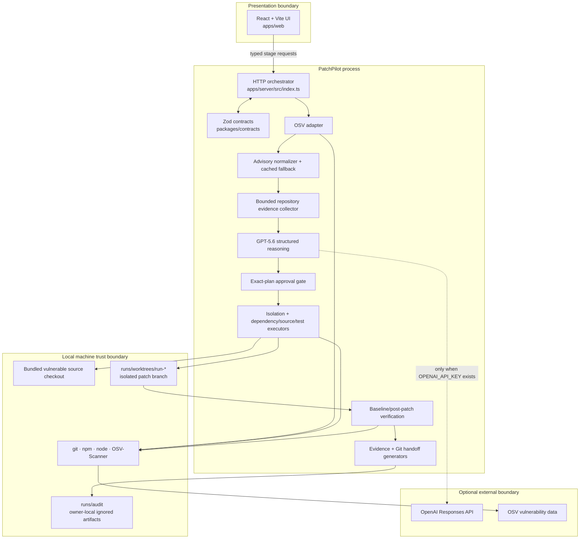
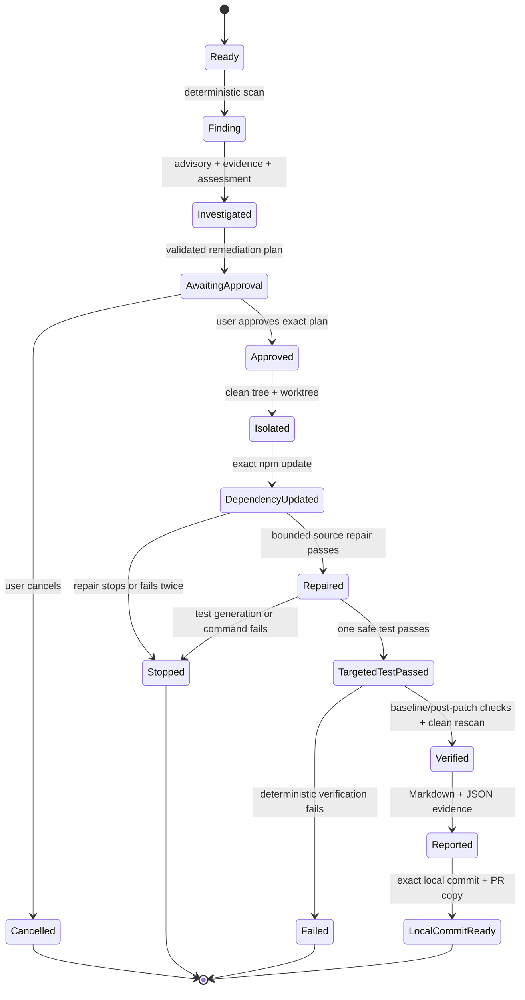

# Architecture

PatchPilot is a local TypeScript application with a React presentation layer, a Node.js orchestration service, deterministic repository tools, four bounded GPT‑5.6 reasoning roles, and Zod contracts between every stage.

This document describes the implemented hackathon build. It does not describe a generic production platform.

## Component diagram



The model never invokes Git, npm, Node, OSV-Scanner, or the filesystem. It returns structured interpretation or proposals; deterministic executors validate and act only after the approval boundary.

## Workflow state machine



Server stores are intentionally in-memory and single-session. Restarting the service loses workflow objects, although ignored local worktrees and audit files remain until reset or cleanup.

## Trust boundaries

| Boundary | Accepted input | Enforcement | Output classification |
| --- | --- | --- | --- |
| Browser → orchestrator | Known demo endpoints and schema-bound IDs/decisions | JSON size limit and Zod request parsing | User intent or workflow request |
| Repository → evidence | Bounded JS/TS/JSON files, package metadata, exact excerpts | Canonical paths, symlink/size/file-count exclusions, repository-relative references | Deterministic fact |
| Advisory → model | Normalized advisory fields without proof-of-concept sections | Dedicated schema, matching ID, cached provenance | Deterministic fact |
| Evidence → GPT‑5.6 | Only stage-specific compact context | Strict context builders, no absolute paths or arbitrary scanner/log dumps | Model input |
| GPT‑5.6 → executor | Structured assessment/plan/replacement/test proposal | Zod plus semantic allowlists and citation validation | Interpretation or proposal |
| User → patch executor | Exact plan decision | SHA-256 plan ID and immutable approval/cancel state | Human decision |
| Executor → filesystem | Fixed files and fixed command families | Canonical containment, clean-state checks, exact diff checkpoints, time/output limits | Deterministic action/result |
| Verification → report | Accepted plan/run chain and retained diffs | Plan/run identity, cited-line revalidation, selected-advisory state | Deterministic composition |
| Local handoff → remote | Nothing in bundled demo | No remote configured; state fixed to `not_requested` | No external side effect |

## Scanner adapter

`apps/server/src/scanning/osvScanner.ts` resolves the repository and requires both `package.json` and `package-lock.json`. It invokes OSV-Scanner directly with an argument array, a 30-second timeout, and a 5 MiB output cap.

The adapter handles OSV-Scanner’s exit semantics deliberately:

- exit `0`: parse valid JSON, including a clean result;
- exit `1`: accept only when stdout contains valid finding JSON;
- any other execution result or malformed JSON: fail the scan.

`normalizeOsvOutput` converts only npm findings into PatchPilot’s strict contract. The scanner version is recorded. The setup script pins `2.3.8` and verifies the upstream SHA-256 checksum before installing under ignored `tools/bin/`.

The post-patch rescan is lockfile-scoped because OSV-Scanner directory discovery ignores Git worktree roots:

```text
osv-scanner scan source --lockfile package-lock.json --format json --verbosity error
```

## Advisory and repository evidence

The advisory service normalizes live OSV data into identity, aliases, summary, details, severity, ranges, fixes, affected functions, references, and provenance. A checked-in advisory is used when live enrichment is absent or unusable and is always labeled `cached-demo`.

The repository collector searches a bounded set of JavaScript, TypeScript, and JSON source files. It skips dependencies, Git data, build output, lockfiles, oversized files, and symlinks. Evidence uses stable IDs, repository-relative paths, positive line ranges, compact excerpts, and factual explanations. Absence evidence explicitly says that a missed reference is not proof of non-applicability.

Before reporting, every positioned excerpt is read again from the unchanged source and must still match the stored file/line range.

## Model context construction

GPT‑5.6 is used only through the Responses API with `store: false`, medium reasoning effort, low verbosity, and Zod-backed Structured Outputs. Each role has a distinct minimal context:

| Role | Context admitted | Semantic validation |
| --- | --- | --- |
| Affectedness | Normalized advisory, package relationship, repository metadata, bounded evidence | Known unique evidence IDs, no absence-as-support, verdict must agree with deterministic call-site facts |
| Remediation plan | Finding, assessment, package metadata, cited excerpts, test structure, file/command allowlists | Supplied fixed version only; known files/commands only; human approval always required |
| Compatibility repair | Approved facts, dependency result, exact `parseUserTheme` function, optional filtered syntax failure | One exact function replacement; required parse and supported fields; no imports, commands, dependencies, broad spreads, or dynamic execution |
| Targeted test | Approved intent, patch facts, repaired function, bounded existing test file | Exactly one benign test; no prototype keys/payloads, imports, process/network access, or extra commands |

If `OPENAI_API_KEY` is absent, checked-in `cached-demo` outputs pass through the same schemas and semantic validators. They are never labeled as live responses.

## Approval and patch isolation

The remediation plan is validated before display. Its canonical content is hashed into `plan-<sha256>`. The user can approve or cancel that exact ID; the decision is immutable, and any plan-content change invalidates the approval.

Isolation then:

1. checks approval before the first possible write;
2. canonicalizes the project, Git root, worktree root, and audit root;
3. requires a clean source worktree including untracked files;
4. records the source branch and baseline commit;
5. creates `patchpilot/run-<uuid>` in `runs/worktrees/`;
6. verifies branch, baseline, mapped repository path, and clean source state;
7. writes an ordered owner-local audit artifact.

Every later stage revalidates the same run/plan identity, branch, baseline, source cleanliness, exact changed-file set, and the bytes of prior retained diffs.

## Mutation stages

The patch is deliberately four files:

| Stage | Allowed change | Deterministic checkpoint |
| --- | --- | --- |
| Dependency update | `package.json`, `package-lock.json` | json5 is exactly `1.0.2` in manifest and lockfile; all unrelated dependency structure is unchanged |
| Compatibility repair | `src/theme.js` | Only `parseUserTheme` replacement; `node --check src/theme.js` passes; at most two attempts |
| Targeted test | `test/theme.test.js` | Exactly one benign test; `node --test test/theme.test.js` passes; failed test is restored |

The model proposes source/test text but cannot widen the file or command boundary. Mutation-time exceptions restore the current stage where designed, and terminal stops make no later verification claim.

## Verification flow

Verification first confirms the approved four-file diff is intact. It then records eight ordered command facts:

```text
baseline     npm ci --ignore-scripts
baseline     npm test
baseline     npm run build
post-patch   npm ci --ignore-scripts
post-patch   node --test test/theme.test.js
post-patch   npm test
post-patch   npm run build
rescan       osv-scanner scan source --lockfile package-lock.json --format json --verbosity error
```

Each record includes phase, kind, displayed command, raw exit code, duration, bounded/redacted stdout/stderr summaries, truncation state, and normalized status. A failed install/test/build stops later commands. Scanner execution failure and continued presence of the selected advisory are distinct terminal classifications.

`verified` requires all seven install/test/build commands to pass, a usable rescan with `GHSA-9c47-m6qq-7p4h` absent, the exact patch still present, and the source checkout still clean.

## Report generation

The report generator is deterministic composition; it makes no model call. It binds the original finding, repository evidence, affectedness interpretation, human approval, remediation plan, dependency/source/test diffs, eight command facts, normalized rescan, uncertainty, and final status to one plan/run identity.

Artifacts are written with owner-only permissions:

```text
runs/audit/run-<uuid>-report.md
runs/audit/run-<uuid>-report.json
```

The Markdown repeats trust labels in headings. The JSON separates `deterministicFacts`, `modelInterpretation`, `humanDecision`, `uncertainty`, and `finalStatus`. Returned references are repository-relative and exclude absolute local paths.

## Local Git handoff

After a verified report, the handoff revalidates the branch, direct baseline parent, source cleanliness, and exact four-file diff. It stages only those files and creates:

```text
fix: remediate GHSA-9c47-m6qq-7p4h in json5
```

Git hooks and signing are disabled for this deterministic local demo commit. The resulting branch, parent, message, file set, and clean worktrees are verified again. PR-ready copy summarizes tests, rescan, model/Codex provenance, limitations, and report paths without exposing absolute local paths.

The nested demo repository has no remote. The handoff contract therefore returns `not_requested` and requires separate approval plus target configuration before any push or draft PR. No remote publication endpoint or merge path exists.

## Artifact and state lifecycle

- Source fixture: nested Git repository, reset to the `vulnerable` tag by `demo/reset-demo.sh`.
- Session state: in-memory stores keyed by plan/run ID; intentionally lost on restart.
- Worktrees: ignored under `runs/worktrees/`.
- Audit and report files: ignored under `runs/audit/`, owner-local where created by PatchPilot.
- Cached model/advisory fixtures: checked in under `demo/expected/` and `demo/cached-advisories/` with explicit provenance.
- Remote systems: OSV data and optional OpenAI Responses API only; no repository publication.

## Design consequences

The architecture favors a reliable, inspectable hackathon proof over breadth. It is strong for the single golden path because every transition has exact inputs and checkpoints. The same hard-coded boundaries mean it is not generic local-repository support. See [Security model](security-model.md), [Testing strategy](testing-strategy.md), [Known limitations](limitations.md), and [Roadmap](roadmap.md).
